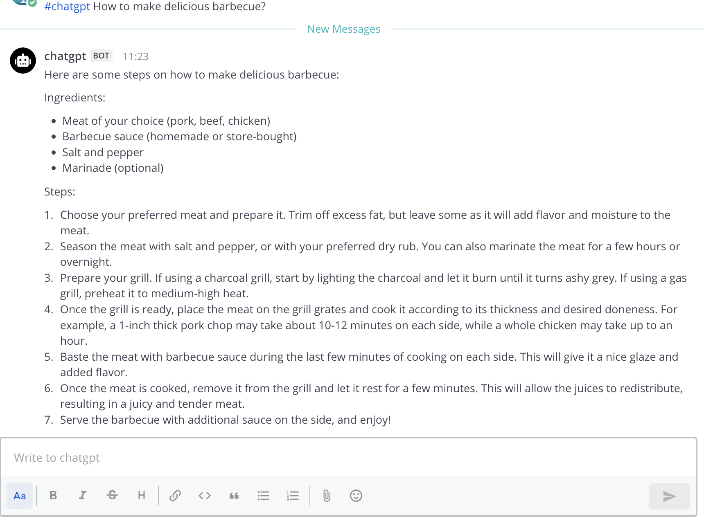
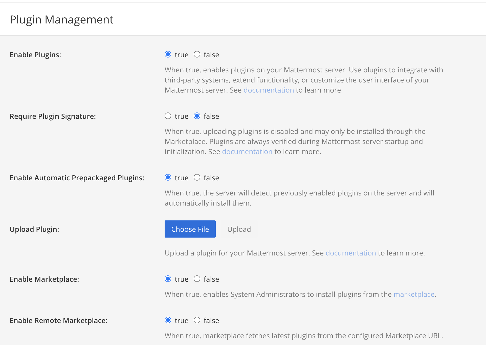
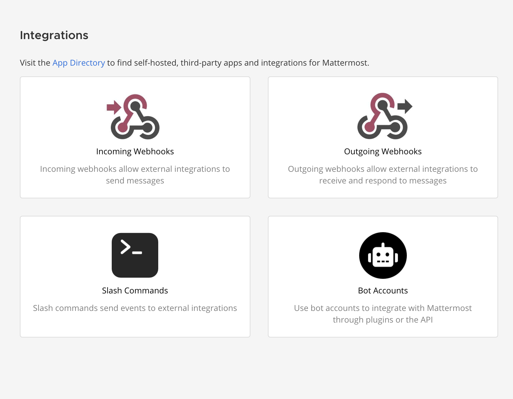
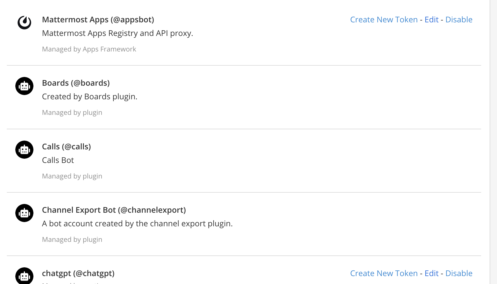
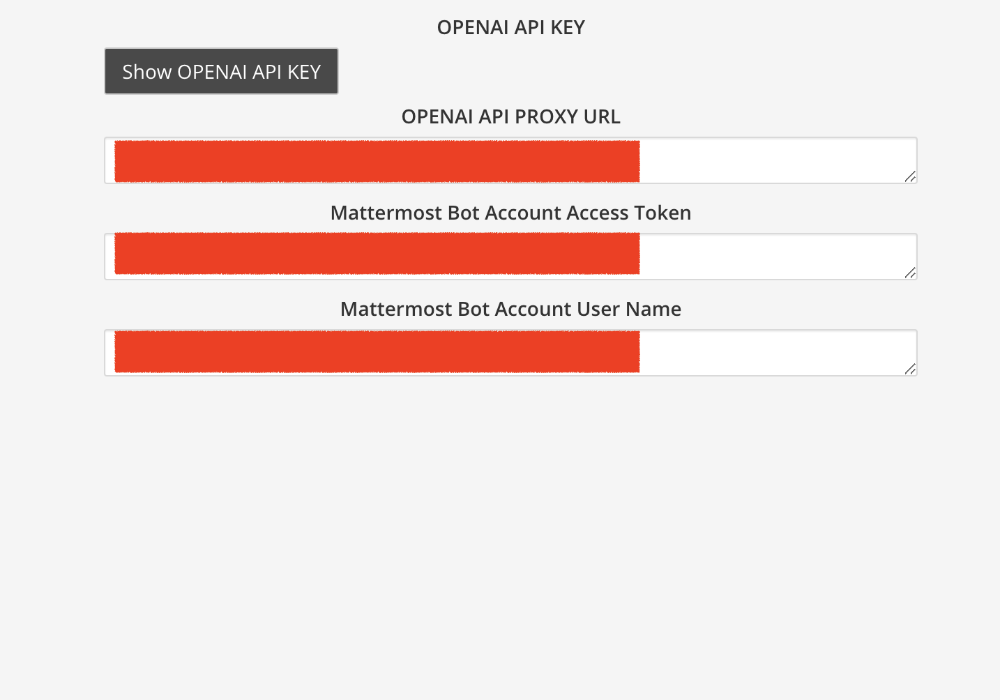

# mattermost-plugin-chatgpt

## Getting Started

### Overview

_Mattermost Plugin ChatGPT_ is a third party developed (**NOT by OpenAI or Mattermost**) plugin for using ChatGPT as a chat robot in Mattermost Clients, starting with the trigger word **#chatgpt** followed by a prompt, a user-defined robot called chatgpt will give its response using OpenAI's API. 

### How to use

User should have the admin access to your Mattermost server

 - Upload the plugin's tar.gz file through Mattermost System Console

 

 - Create a bot account with the admin access and **write down its name and access token**(NOT the token id, only visible once when being created)

 

 

 - Fill information in the Plugin's Admin Console

 

  1. First you need to get a OpenAI's API Key

  2. Fill the Bot Account's access token and user name

  3. Fill the Proxy URL, it should be "https://api.openai.com" by default

 - Enjoy!